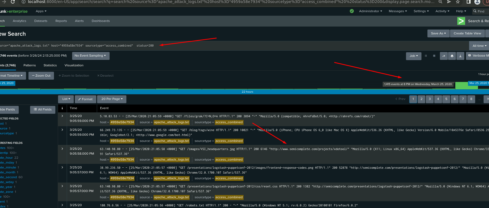

<h2>Load and Analyze Apache Attack Logs</h2>

- Access the Reports tab and select Yours to view the reports created from Part 1.

- Select Edit > Open in Search.

- Take note of the percent/count.

- Change the source from: source="apache_logs.txt" to source="apache_attack_logs.txt".

- Select Save.

  <b><h3>------------------Reports------------------</h3></b>

- <b>Before Attack</b>
  

  
- <b>After Attack</b>

- Did you detect any suspicious changes in HTTP methods? If so, which one?

`Yes, GET decrease from 98.5% to 70.2% and POST increase from 1% to 29%`

- What is that method used for?
   
`POST Method is used to send data from the client to a server to create/update a resource`

- <b>Before Attack</b>

- <b>After Attack</b>

- Did you detect any suspicious changes in referrer domains?

`We have observed a similar percentage of traffic from semicomplete.com and its sub-domain. We need to analyze this trend more thoroughly to draw accurate conclusions`

- <b>Before Attack</b>

- <b>After Attack</b>

Report Analysis for HTTP Response Codes

-Did you detect any suspicious changes in HTTP response codes? 

`Yes, 200 decrease from 91% to 83% and the most suspicious change was 404 response code increasing from 2% to 15%`

<b><h3>------------------Alerts------------------</h3></b>

- <b>Before Attack</b>

- <b>After Attack</b>

- Did you detect a suspicious volume of international activity?

`Yes, High volume of activity was detected from Ukraine `

- If so, what was the count of the hour(s) it occurred in?

`International activity had 937 events at 8:00 pm on 03/25/20 and 864 events was from Ukraine`

- Would your alert be triggered for this activity?

`Our threshold for Non-US activity more than 180 was correct and our alert would have been triggered at 8:00 pm`

- After reviewing, would you change the threshold that you previously selected?

`It’s not necessary to change the threshold`

- <b>Before Attack</b>

- <b>After Attack</b>

- Did you detect any suspicious volume of HTTP POST activity?

`Yes, we detected a high volume of HTTP POST activity`

- If so, what was the count of the hour(s) it occurred in?

`POST activity has a total count of 1296 at 8:00 pm`

- When did it occur?

`At 8:00 p.m. on Wednesday, March 25th, 2020`

- After reviewing, would you change the threshold that you previously selected?  

`I would not initially change the threshold, our alert with more than 15 events was correct, and it would have been triggered at 8:00 pm`

<b><h3>------------------Dashboard Setup------------------</h3></b>

- Access the Apache Web Server Monitoring dashboard.

- Select “Edit.”
- For each panel that you created, access the panel and complete the following steps:
- Select “Edit Search.”
- Change the source from source="apache_logs.txt" to source="apache_attack_logs.txt".
- Select “Apply.”
- Save the whole dashboard.
- Change the time on the whole dashboard to “All Time.”

- <b>Before Attack</b>

- <b>After Attack</b>

<b><h3>Dashboard Analysis for Time Chart of HTTP Methods</h3></b>

- Which method seems to be used in the attack?

`GET and POST methods seemed to be used in the attack`

- At what times did the attack start and stop?

`GET attack started on 3/25/20 at 6:05:00.00 PM and stopped at 6:05:59.000 PM`

`POST attack started on 3/25/20 at 8:05:00.0 PM and stopped at 8:05:59.000 PM` 

- What is the peak count of the top method during the attack?
    
`GET peak count was 729`
`POST peak count was 1296`

<b><h3>Dashboard Analysis for Cluster Map</h3></b>

- Does anything stand out as suspicious?

`There was suspicious activity in Ukraine`

- Which new location (city, country) on the map has a high volume of activity? (Hint: Zoom in on the map.)

`City, Country = Kiev, Ukraine `
`City, Country = Kharkiv, Ukraine `

- What is the count of that city?
    
`Kiev (439) and Kharkiv (432)`

<b><h3>Dashboard Analysis for URI Data</h3></b>

- Does anything stand out as suspicious?

`/files/logstash/logstash-1.3.2-monolithic.jar from 0 to 14% `
`/VSI_Account_logon.php had an increase from 8% to 29%`

- What URI is hit the most?

` /VSI_Account_logon.php  with 1296 at 8:00 PM`

- Based on the URI being accessed, what could the attacker potentially be doing?

`Based on the URI that has been attacked “/VSI_Account_logon.php” the attacker could potentially be trying a brute force attack and “/files/logstash/logstash-1.3.2-monolithic.jar” probability reconnaissance or DDoS attack due 404 code response that indicate the server cannot find the requested resource.`

<b><h3>Deep Analyze of Referrer Domains</h3></b>

<b>We have observed a similar percentage of traffic from semicomplete.com and its sub-domain.</b>

<b>Explanation:</b> As you can see, there is no evident change or spike after the attack. This is because the majority of the traffic is coming from “-”. At 6 PM, the majority status count was 404 with 624 events, while at 8 PM, the majority status was 200 with 1,415 events.

<b>With these pictures, we can assume that there was an error in the logs and the traffic is really coming from "semicomplete" instead of "-".</b>

<h2>Load and Analyze Windows Servers Attack Logs</h2>

- Access the Reports tab and select Yours to view the reports created from Part 1.

- Select Edit > Open in Search.

- Take note of the percent/count.

- Change the source from: source="windows_server_logs.csv" to source="windows_server_attack_logs.csv"

- Select Save.

  <b><h3>------------------Reports------------------</h3></b>

- <b>Before Attack</b>
  

  
- <b>After Attack</b>

- Did you detect any suspicious changes in severity?

`Yes, we detected a significantly increase on high severity from 7% to 20%`

- <b>Before Attack</b>
  

  
- <b>After Attack</b>

- Did you detect any suspicious changes in failed activities?

`No, there are no noticeable changes in this report on failed activities, from 3% to 1.6%`

 

<b><h3>------------------Alerts------------------</h3></b>

 

- <b>Before Attack</b>
  

  
- <b>After Attack</b>

- Did you detect a suspicious volume of failed activity?

`Yes, there are a suspicious volume of failed activity at specific time`

- If so, what was the count of events in the hour(s) it occurred?

`35 events during one hour`

- When did it occur?

`8:00 AM on Wednesday, 03/25/20 specifically 8:28 AM until 8:40 AM`

- Would your alert be triggered for this activity?

`Yes, our threshold of Failed Windows Activity more than 15 was correct and our alert would have been triggered at 8:00 am`

- After reviewing, would you change your threshold from what you previously selected?

`No changes is needed`

- <b>Before Attack</b>
  

  
- <b>After Attack</b>

- Did you detect a suspicious volume of successful logins?

`Yes, we detected an increase of successful logins`

- If so, what was the count of events in the hour(s) it occurred?

`196 events at 11 AM and 77 events at 12PM`

- Who is the primary user logging in?

`User_j is the primary user logging in both events with a count of 271 (99%) in a span of 2 hours (11AM-1PM).`

- When did it occur?

`Wed on 03/25/20 11AM - 1PM specifically at 11:04 AM until 12:26 PM `

- Would your alert be triggered for this activity?

`Yes, the alert is within the trigger threshold of 30 per hour`

- After reviewing, would you change your threshold from what you previously selected?

`It’s not necessary to change the threshold`

- <b>Before Attack</b>
  

  
- <b>After Attack</b>

- Did you detect a suspicious volume of deleted accounts?  
   
`No, there were no signs of suspicious volume of deleted accounts, it appears to remain inside normal ranges`

- <b>Before Attack</b>
  

  
- <b>After Attack</b>

- Does anything stand out as suspicious?

`Yes, we detected a high count of “An attempt was made to reset an accounts password” and “A user account was locked out”`

- What signatures stand out?

`“An attempt was made to reset an accounts password” with 2128 events in total and majority from 9 AM to 11AM`

`“A user account was locked out” with 1811 events in total and majority from 1 AM to 3 AM`

- What time did it begin and stop for each signature?

`Wed on 03/25/20:`

`“An attempt was made to reset an accounts password” started been suspicious at 9:13 AM and stopped at 10:54 AM`

`“A user account was locked out” started been suspicious at 1:50 AM and stopped at 2:36 AM`

- What is the peak count of the different signatures?

`“An attempt was made to reset an accounts password” with 1258 events`

`“A user account was locked out” with 896 events`

- <b>Before Attack</b>
  

  
- <b>After Attack</b>

- Does anything stand out as suspicious?

`High and suspicious activity from user_k and user_a`

- Which users stand out?

`User_k with 2118 events in total and majority from 9AM to 11AM`

`User_a with 1878 events in total and majority from 1AM to 3AM`

- What time did it begin and stop for each user?

`Wed on 03/25/20:`

`user_k: started been suspicious at 9:16 AM and stopped at 10:54 AM`

`user_a: started been suspicious at 1:49 AM and stopped at 2:38 AM`

- What is the peak count of the different users?

`user_k with 1256 events`

`user_a with 984 events`

- <b>Before Attack</b>
  

  
- <b>After Attack</b>

- Does anything stand out as suspicious?

`There was suspicious activity at 1AM to 3AM and then 9AM to 11AM on Wed 03/25/20`

- Do the results match your findings in your time chart for signatures?    

`Yes the results were so similar and we can conclude that user_a is the cause of “A user account was locked out” and user_k is the cause of “An attempt was made to reset an accounts password”`

- <b>Before Attack</b>
  

  
- <b>After Attack</b>

- Does anything stand out as suspicious?

`There was suspicious activity at 1AM to 3AM and then 9AM to 11AM on Wed 03/25/20`

- Do the results match your findings in your time chart for users?

`Yes the results were so similar and same conclusion signatures: “A user account was locked out” was made for user_a and “An attempt was made to reset an accounts password” was made for user_k`

- <b>Before Attack</b>
  

  
- <b>After Attack</b>

- What are the advantages and disadvantages of using this report, compared to the other user panels that you created?

`Statistical charts are useful for displaying counts and percentages and are easy to set limits for display. A disadvantage is that they show the total data over the timeline, while the panels provide a more specific perspective on how the data is changing over time.`
