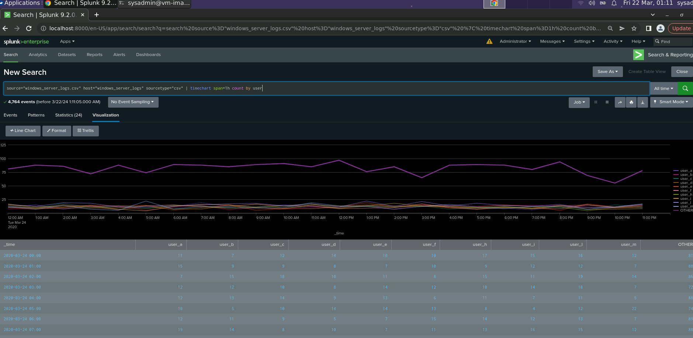

<h1>Splunk-Security-Monitoring-Environment</h1>

I played the role of an SOC Analyst at a small company called Virtual Space Industries (VSI), which designs virtual-reality programs for businesses. The VSI products that you have been tasked with monitoring include: An Apache web server, which hosts the administrative webpage. A Windows operating system, which runs many of VSI’s back-end operations

- VSI recently experienced several cyberattacks, likely from their adversary JobeCorp.

- Fortunately, your SOC team had set up several monitoring solutions to help VSI quickly identify what was attacked.

- These monitoring solutions will also help VSI create mitigation strategies to protect the organization.

- There is an Attack_Analysis.md file that you can access and see the analysis after the attack

Logs provided:

- <b> Apache Server Logs </b>
  - This server is used for VSI's main public-facing website vsi-company.com.
  - [Apache Logs](Logs/apache_logs.txt)
  - [Apache Attack Logs](Logs/apache_attack_logs.txt)

- <b> Windows Server Logs </b>
  - This server contains intellectual property of VSI’s next-generation virtual-reality programs.
  - [Windows Logs](Logs/windows_server_logs.csv)
  - [Windows Attack Logs](/Logs/windows_server_attack_logs.csv)

<h2>Load and Analyze Apache Logs</h2>

Next, Apache web server logs representing “regular” activity for VSI were uploaded and analyzed:

- Select the “Add Data” option within Splunk. Select the “Upload” option. Select the apache_logs.txt.

- After successful upload, “Start Searching” was selected and the time range set to “All Time.”

 

<b><h3>------------------Reports------------------</h3></b>

 

- HTTP Methods Report:

Create a report showing a table of the different HTTP methods (GET, POST, HEAD, etc.).

This will provide insight into the type of HTTP activity being requested against their web server.

`source="apache_logs.txt" | top method`

- Top 10 Referring Domains Report:

Create a report showing the top 10 domains that refer to VSI’s website.

This will assist VSI with identifying suspicious referrers.

`source="apache_logs.txt" | top limit=10 referer_domain`

- HTTP Response Codes Report:

Creat a report showing the count of each HTTP response code.

This will provide insight into any suspicious levels of HTTP responses.

 

<b><h3>------------------Alerts------------------</h3></b>

 

- Non-US Activity Alert:

Determine a baseline and threshold for hourly activity from any country besides the United States.

Create an alert that triggers an email to SOC@VSI-company.com when the threshold is reached.

`source="apache_logs.txt" | iplocation clientip | where Country!="United States"`

Analyzing the next picture

Conclusion: Baseline for hourly activity is around 80 and the spike is 113 the threshold for hourly activity was set at 115

- HTTP POST Method Alert:

Determine a baseline and threshold for the hourly count of the HTTP POST method.

Create an alert that triggers an email to SOC@VSI-company.com when the threshold is reached.

`source="apache_logs.txt" method=POST`

Analyzing the next picture

Conclusion: Baseline for hourly activity is around 3 and the spike is 7 the threshold for hourly activity was set greater than 7

  

 

  <b><h3>------------------Visualizations and Dashboards------------------</h3></b>

 

- Line Chart of HTTP Methods Over Time:

Create a line chart displaying the different HTTP method field values over time, using timechart span=1h count by method.

`source="apache_logs.txt" | timechart span=1h count by method`

- Geographical Map of Client IPs:

Create a geographical map showing the location based on the clientip field.

`source="apache_logs.txt" | iplocation clientip | geostats count`

- Number of Different URIs Visualization:

Create a visualization displaying the number of different URIs.

`source="apache_logs.txt" | top limit=10 uri`

- Top 10 Countries Visualization:

Create a visualization displaying the count of the top 10 countries appearing in the log.

`source="apache_logs.txt" | iplocation clientip | top limit=10 Country`

- User Agents Count Visualization:

Create a visualization illustrating the count of different user agents.

`source="apache_logs.txt" | top useragent`

- Single-Value Visualization:
  
Add a single-value visualization analyzing a single data point, such as a radial gauge or marker gauge.

`source="apache_logs.txt" status=200  | timechart span=1h count by status`

<b>Note: I wanted to create a real-time visualization. However, since there have been no incoming logs in the last hour, it shows 0. </b>

 

- <b>Dashboard</b>

 

<h2>Load and Analyze Windows Servers Logs</h2>

- Select the “Add Data” option within Splunk. Select the “Upload” option. Select the indows_server_logs.csv.

- After successful upload, “Start Searching” was selected and the time range set to “All Time.”
  
 

<b><h3>------------------Reports------------------</h3></b>

 
- Signatures and Signature IDs Report:

Create a report with a table of signatures and associated signature IDs. Remove duplicate values in the SPL search to ensure a clean report.

`source="windows_server_logs.csv" | table signature signature_id | dedup signature`

- Severity Levels Report:

Create a report that displays the severity levels, along with the count and percentage of each.

`source="windows_server_logs.csv" | top severity`

- Success vs. Failure Report:

Create a report comparing the success and failure of Windows activities, using the status field for information.

`source="windows_server_logs.csv" | top status`

 

<b><h3>------------------Alerts------------------</h3></b>

 

- Failed Windows Activity Alert:

Determine a baseline and threshold for the hourly level of failed Windows activity.

Create an alert that triggers an email to SOC@VSI-company.com when the threshold is reached.

`source="windows_server_logs.cvs" status="failure"`

Analyzing the next picture

Conclusion: Baseline for hourly activity is around 9, the threshold for hourly activity was set at 15

- Successful Login Alert:

Determine a baseline and threshold for the hourly count of the signature “an account was successfully logged on.”

Create an alert based on the corresponding signature ID that triggers an email to SOC@VSI-company.com when the threshold is reached.

`source="windows_server_logs.csv" signature="An account was successfully logged on"`

- Baseline for hourly success of logged on accounts: 12.
- Threshold for hourly success of logged on accounts: 30.

- User Account Deletion Alert:

Determine a baseline and threshold for the hourly count of the signature “a user account was deleted.”

Create an alert based on the corresponding signature ID that triggers an email to SOC@VSI-company.com when the threshold is reached.

`source="windows_server_logs.csv" signature_id=4726`

Analyzing the next picture

Conclusion: Baseline for hourly activity is around 17, the threshold for hourly activity was set at 20

 

  <b><h3>------------------Visualizations and Dashboards------------------</h3></b>

 

- Line Chart of Signatures Over Time:

Create a line chart displaying the different signature field values over time, using timechart span=1h count by signature.

`source="windows_server_logs.csv" | timechart span=1h count by signature`

- Line Chart of Users Over Time:

Create a line chart displaying the different user field values over time.

`source="windows_server_logs.csv" | timechart span=1h count by user`

- Count of Different Signatures Visualization:

Create a visualization illustrating the count of different signatures.

`source="windows_server_logs.csv" | top signature`

- Count of Different Users Visualization:

Create a visualization illustrating the count of different users.

`source="windows_server_logs.csv" | top user`

- Single-Value Visualization:

Add a single-value visualization analyzing a single data point, such as a radial gauge or marker gauge.

`source="windows_server_logs.csv" severity=high | timechart span=1h count

<b>Note: I wanted to create a real-time visualization. However, since there have been no incoming logs in the last hour, it shows 0. </b>

