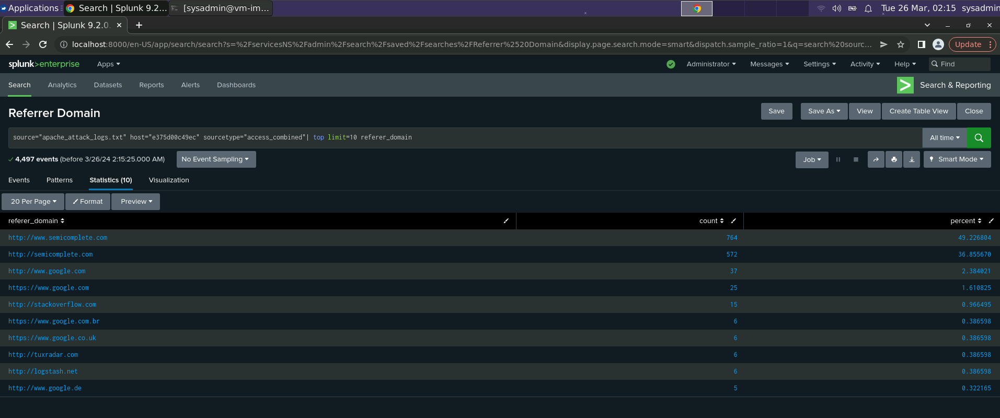
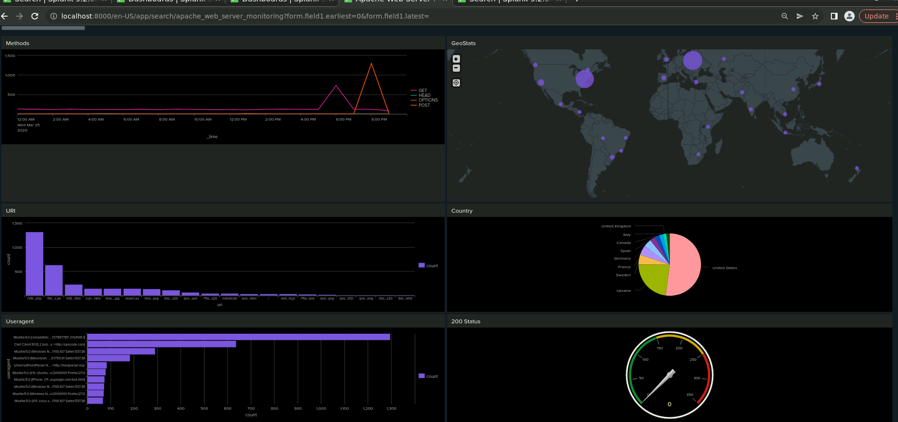
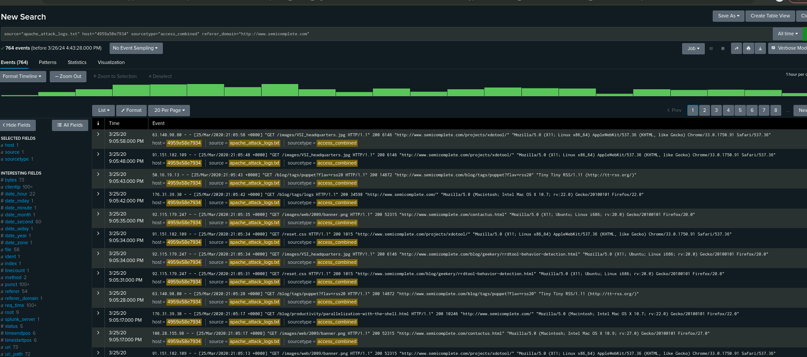
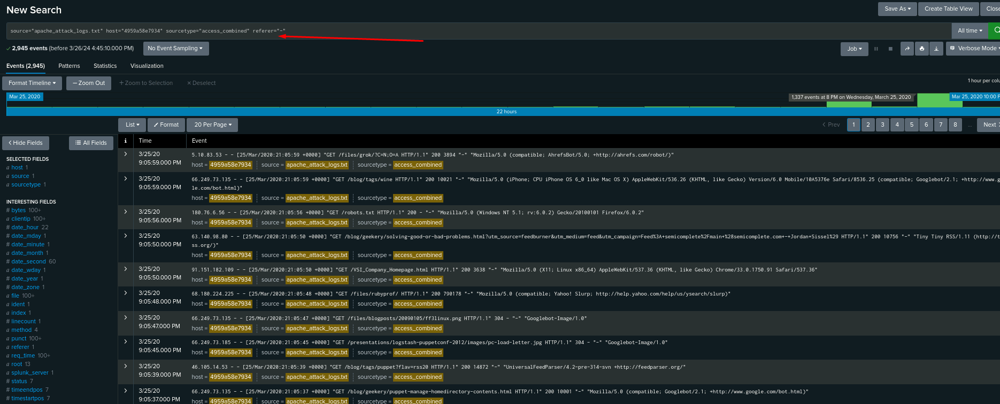
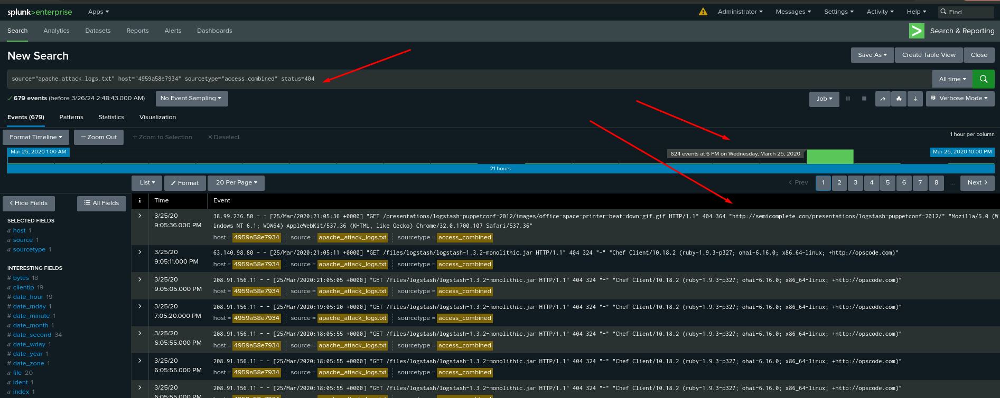

<h1>Splunk-Security-Monitoring-Environment</h1>

I played the role of an SOC Analyst at a small company called Virtual Space Industries (VSI), which designs virtual-reality programs for businesses. The VSI products that you have been tasked with monitoring include: An Apache web server, which hosts the administrative webpage. A Windows operating system, which runs many of VSI’s back-end operations

- VSI recently experienced several cyberattacks, likely from their adversary JobeCorp.

- Fortunately, your SOC team had set up several monitoring solutions to help VSI quickly identify what was attacked.

- These monitoring solutions will also help VSI create mitigation strategies to protect the organization.

Logs provided:

- <b> Apache Server Logs </b>
  - This server is used for VSI's main public-facing website vsi-company.com.
  - [Apache Logs](Logs/apache_logs.txt)
  - [Apache Attack Logs](Logs/apache_attack_logs.txt)

- <b> Windows Server Logs </b>
  - This server contains intellectual property of VSI’s next-generation virtual-reality programs.
  - [Windows Logs](Logs/windows_server_logs.csv)
  - [Windows Attack Logs](/Logs/windows_server_attack_logs.csv)

<h2>Load and Analyze Apache Logs</h2>

Next, Apache web server logs representing “regular” activity for VSI were uploaded and analyzed:

- Select the “Add Data” option within Splunk. Select the “Upload” option. Select the apache_logs.txt.

- After successful upload, “Start Searching” was selected and the time range set to “All Time.”

 

<b><h3>------------------Reports------------------</h3></b>

 

- HTTP Methods Report:

Create a report showing a table of the different HTTP methods (GET, POST, HEAD, etc.).

This will provide insight into the type of HTTP activity being requested against their web server.

`source="apache_logs.txt" | top method`

- Top 10 Referring Domains Report:

Create a report showing the top 10 domains that refer to VSI’s website.

This will assist VSI with identifying suspicious referrers.

`source="apache_logs.txt" | top limit=10 referer_domain`

- HTTP Response Codes Report:

Creat a report showing the count of each HTTP response code.

This will provide insight into any suspicious levels of HTTP responses.

 

<b><h3>------------------Alerts------------------</h3></b>

 

- Non-US Activity Alert:

Determine a baseline and threshold for hourly activity from any country besides the United States.

Creat an alert that triggers an email to SOC@VSI-company.com when the threshold is reached.

`source="apache_logs.txt" | iplocation clientip | where Country!="United States"`

Analyzing the next picture

Conclusion: Baseline for hourly activity is around 80 and the spike is 113 the threshold for hourly activity was set at 115

- HTTP POST Method Alert:

Determine a baseline and threshold for the hourly count of the HTTP POST method.

Create an alert that triggers an email to SOC@VSI-company.com when the threshold is reached.

`source="apache_logs.txt" method=POST`

Analyzing the next picture

Conclusion: Baseline for hourly activity is around 3 and the spike is 7 the threshold for hourly activity was set greater than 7

  

 

  <b><h3>------------------Visualizations and Dashboards------------------</h3></b>

 

- Line Chart of HTTP Methods Over Time:

Create a line chart displaying the different HTTP method field values over time, using timechart span=1h count by method.

`source="apache_logs.txt" | timechart span=1h count by method`

- Geographical Map of Client IPs:

Create a geographical map showing the location based on the clientip field.

`source="apache_logs.txt" | iplocation clientip | geostats count`

- Number of Different URIs Visualization:

Create a visualization displaying the number of different URIs.

`source="apache_logs.txt" | top limit=10 uri`

- Top 10 Countries Visualization:

Create a visualization displaying the count of the top 10 countries appearing in the log.

`source="apache_logs.txt" | iplocation clientip | top limit=10 Country`

- User Agents Count Visualization:

Create a visualization illustrating the count of different user agents.

`source="apache_logs.txt" | top useragent`

- Single-Value Visualization:
  
Add a single-value visualization analyzing a single data point, such as a radial gauge or marker gauge.

`source="apache_logs.txt" status=200  | timechart span=1h count by status`

<b>Note: I wanted to create a real-time visualization. However, since there have been no incoming logs in the last hour, it shows 0. </b>

 

- <b>Dashboard</b>

<h2>Load and Analyze Apache Attack Logs</h2>

- Access the Reports tab and select Yours to view the reports created from Part 1.

- Select the report that analyzes the different HTTP methods.

- Select Edit > Open in Search.

- Take note of the percent/count of the various methods.

- Change the source from: source="apache_logs.txt" to source="apache_attack_logs.txt".

- Select Save.

  <b><h3>------------------Reports------------------</h3></b>

- <b>Before Attack</b>
  

  
- <b>After Attack</b>

- Did you detect any suspicious changes in HTTP methods? If so, which one?

`Yes, GET decrease from 98.5% to 70.2% and POST increase from 1% to 29%`

- What is that method used for?
   
`POST Method is used to send data from the client to a server to create/update a resource`

- <b>Before Attack</b>

- <b>After Attack</b>

- Did you detect any suspicious changes in referrer domains?

`We have observed a similar percentage of traffic from semicomplete.com and its sub-domain. We need to analyze this trend more thoroughly to draw accurate conclusions`

- <b>Before Attack</b>

- <b>After Attack</b>

Report Analysis for HTTP Response Codes

-Did you detect any suspicious changes in HTTP response codes? 

`Yes, 200 decrease from 91% to 83% and the most suspicious change was 404 response code increasing from 2% to 15%`

<b><h3>------------------Alerts------------------</h3></b>

- <b>Before Attack</b>

- <b>After Attack</b>

- Did you detect a suspicious volume of international activity?

`Yes, High volume of activity was detected from Ukraine `

- If so, what was the count of the hour(s) it occurred in?

`International activity had 937 events at 8:00 pm on 03/25/20 and 864 events was from Ukraine`

- Would your alert be triggered for this activity?

`Our threshold for Non-US activity more than 180 was correct and our alert would have been triggered at 8:00 pm`

- After reviewing, would you change the threshold that you previously selected?

`It’s not necessary to change the threshold`

- <b>Before Attack</b>

- <b>After Attack</b>

- Did you detect any suspicious volume of HTTP POST activity?

`Yes, we detected a high volume of HTTP POST activity`

- If so, what was the count of the hour(s) it occurred in?

`POST activity has a total count of 1296 at 8:00 pm`

- When did it occur?

`At 8:00 p.m. on Wednesday, March 25th, 2020`

- After reviewing, would you change the threshold that you previously selected?  

`I would not initially change the threshold, our alert with more than 15 events was correct, and it would have been triggered at 8:00 pm`

<b><h3>------------------Dashboard Setup------------------</h3></b>

- Access the Apache Web Server Monitoring dashboard.

- Select “Edit.”
- For each panel that you created, access the panel and complete the following steps:
- Select “Edit Search.”
- Change the source from source="apache_logs.txt" to source="apache_attack_logs.txt".
- Select “Apply.”
- Save the whole dashboard.
- Change the time on the whole dashboard to “All Time.”

- <b>Before Attack</b>

- <b>After Attack</b>

<b><h3>Dashboard Analysis for Time Chart of HTTP Methods</h3></b>

- Which method seems to be used in the attack?

`GET and POST methods seemed to be used in the attack`

- At what times did the attack start and stop?

`GET attack started on 3/25/20 at 6:05:00.00 PM and stopped at 6:05:59.000 PM`

`POST attack started on 3/25/20 at 8:05:00.0 PM and stopped at 8:05:59.000 PM` 

- What is the peak count of the top method during the attack?
    
`GET peak count was 729`
`POST peak count was 1296`

<b><h3>Dashboard Analysis for Cluster Map</h3></b>

- Does anything stand out as suspicious?

`There was suspicious activity in Ukraine`

- Which new location (city, country) on the map has a high volume of activity? (Hint: Zoom in on the map.)

`City, Country = Kiev, Ukraine `
`City, Country = Kharkiv, Ukraine `

- What is the count of that city?
    
`Kiev (439) and Kharkiv (432)`

<b><h3>Dashboard Analysis for URI Data</h3></b>

- Does anything stand out as suspicious?

`/files/logstash/logstash-1.3.2-monolithic.jar from 0 to 14% `
`/VSI_Account_logon.php had an increase from 8% to 29%`

- What URI is hit the most?

` /VSI_Account_logon.php  with 1296 at 8:00 PM`

- Based on the URI being accessed, what could the attacker potentially be doing?

`Based on the URI that has been attacked “/VSI_Account_logon.php” the attacker could potentially be trying a brute force attack and “/files/logstash/logstash-1.3.2-monolithic.jar” probability reconnaissance or DDoS attack due 404 code response that indicate the server cannot find the requested resource.`

<b><h3>Deep Analyze of Referrer Domains</h3></b>

<b>We have observed a similar percentage of traffic from semicomplete.com and its sub-domain.</b>

<b>Explanation:</b> As you can see, there is no evident change or spike after the attack. This is because the majority of the traffic is coming from “-”. At 6 PM, the majority status count was 404 with 624 events, while at 8 PM, the majority status was 200 with 1,415 events.

<b>With these pictures, we can assume that there was an error in the logs and the traffic is really coming from "semicomplete" instead of "-".</b>
