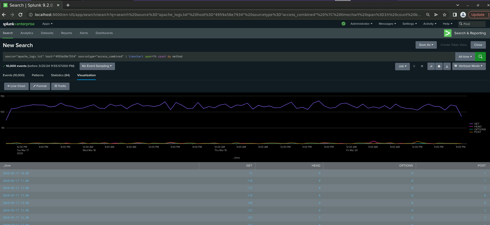

<h1>Splunk-Security-Monitoring-Environment</h1>

I played the role of an SOC Analyst at a small company called Virtual Space Industries (VSI), which designs virtual-reality programs for businesses. The VSI products that you have been tasked with monitoring include: An Apache web server, which hosts the administrative webpage. A Windows operating system, which runs many of VSI’s back-end operations

Logs provided:

- <b> Apache Server Logs </b>
  - This server is used for VSI's main public-facing website vsi-company.com.
  - [Apache Logs](Logs/apache_logs.txt)
  - [Apache Attack Logs](Logs/apache_attack_logs.txt)

- <b> Windows Server Logs </b>
  - This server contains intellectual property of VSI’s next-generation virtual-reality programs.
  - [Windows Logs](Logs/windows_server_logs.csv)
  - [Windows Attack Logs](/Logs/windows_server_attack_logs.csv)

<h2>Load and Analyze Apache Logs</h2>

Next, Apache web server logs representing “regular” activity for VSI were uploaded and analyzed:

- Select the “Add Data” option within Splunk. Select the “Upload” option. Select the apache_logs.txt.

- After successful upload, “Start Searching” was selected and the time range set to “All Time.”

 

<b>------------------Reports------------------</b>

 

- HTTP Methods Report:

Create a report showing a table of the different HTTP methods (GET, POST, HEAD, etc.).

This will provide insight into the type of HTTP activity being requested against their web server.

`source="apache_logs.txt" | top method`

- Top 10 Referring Domains Report:

Create a report showing the top 10 domains that refer to VSI’s website.

This will assist VSI with identifying suspicious referrers.

`source="apache_logs.txt" | top limit=10 referer_domain`

- HTTP Response Codes Report:

Creat a report showing the count of each HTTP response code.

This will provide insight into any suspicious levels of HTTP responses.

 

<b>------------------Alerts------------------</b>

 

- Non-US Activity Alert:

Determine a baseline and threshold for hourly activity from any country besides the United States.

Creat an alert that triggers an email to SOC@VSI-company.com when the threshold is reached.

`source="apache_logs.txt" | iplocation clientip | where Country!="United States"`

Analyzing the next picture

Conclusion: Baseline for hourly activity is around 80 and the spike is 113 the threshold for hourly activity was set at 115

- HTTP POST Method Alert:

Determine a baseline and threshold for the hourly count of the HTTP POST method.

Create an alert that triggers an email to SOC@VSI-company.com when the threshold is reached.

`source="apache_logs.txt" method=POST`

Analyzing the next picture

Conclusion: Baseline for hourly activity is around 3 and the spike is 7 the threshold for hourly activity was set greater than 7

  

 

  <b>------------------Visualizations and Dashboards------------------</b>

 

- Line Chart of HTTP Methods Over Time:

Create a line chart displaying the different HTTP method field values over time, using timechart span=1h count by method.

`source="apache_logs.txt" | timechart span=1h count by method`

- Geographical Map of Client IPs:

Create a geographical map showing the location based on the clientip field.

`source="apache_logs.txt" | iplocation clientip | geostats count`

- Number of Different URIs Visualization:

Create a visualization displaying the number of different URIs.

`source="apache_logs.txt" | top limit=10 uri`

- Top 10 Countries Visualization:

Create a visualization displaying the count of the top 10 countries appearing in the log.

`source="apache_logs.txt" | iplocation clientip | top limit=10 Country`

- User Agents Count Visualization:

Create a visualization illustrating the count of different user agents.

`source="apache_logs.txt" | top useragent`

- Single-Value Visualization:

Add a single-value visualization analyzing a single data point, such as a radial gauge or marker gauge.

